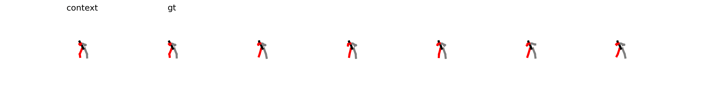
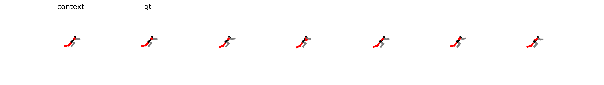
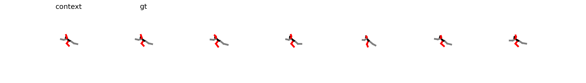
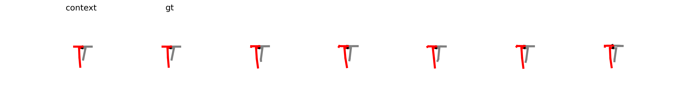
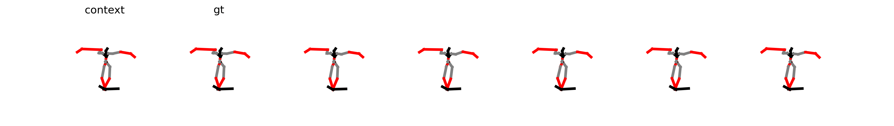

## Code for "AthleticFlow: Flow Matching with Guidance of Human Kinematics for 3D Athletic Motion Prediction".

### Data

Please  download all files from [GoogleDrive](https://drive.google.com/drive/folders/1hTTGkzFtvehHheMAltARRHRfy1ZLqQO3?usp=drive_link) and put `/data` directory on the root path of project.

Final `./data` directory structure is shown below:

```
data
├─athlete_pose_3d_v3
│  │  train_box_fps.npy
│  │  train_center_fps.npy
│  │  train_joint_3d_camera.npy
│  │  train_joint_3d_camera_fps.npy
│  │  train_joint_3d_image_fps.npy
│  │  train_meta.joblib
│  │  train_meta_fps.joblib
│  │  train_scale_fps.npy
│  │  valid_box_fps.npy
│  │  valid_center_fps.npy
│  │  valid_joint_3d_camera.npy
│  │  valid_joint_3d_camera_fps.npy
│  │  valid_joint_3d_image_fps.npy
│  │  valid_meta.joblib
│  │  valid_meta_fps.joblib
│  │  valid_scale_fps.npy
│  │
│  └─multimodal
│          data_candi_t_his15_t_pred60_skiprate15.npz
│          t_his15_top50_t_pred60_thre0.100_filtered_dlow.npz
│
├─AthleticsPose
│  │  test.npz
│  │  train.npz
│  │
│  └─multimodal
│          data_candi_t_his15_t_pred60_skiprate15.npz
│          t_his15_1_thre0.500_t_pred60_thre0.100_index_filterd.npz
│
└─worldpose
    │  wp_data_py3.npz
    │
    └─multimodal
            data_candi_t_his25_t_pred100_skiprate25.npz
            t_his25_1_thre0.500_t_pred100_thre0.010_index_filterd.npz
            t_his25_1_thre0.500_t_pred100_thre0.100_index_filterd.npz
```

### Pretrained Model

We put pretrained models in `./results/{dataset}_af/models` foldels.

### Training

For AthletePose3D:

```
python main_fm.py --cfg ap3d_af --mode train
```

For AthleticsPose:

```
python main_fm.py --cfg ap_af --mode train
```

For WorldPose:

```
python main_fm.py --cfg wp_af --mode train
```

### Evaluation

Evaluate on AthletePose3D:

```
python main_fm.py --cfg ap3d_af --mode eval --ckpt ./results/ap3d_af/models/ckpt_ema_1000.pt
```

Evaluate on AthleticsPose:

```
python main_fm.py --cfg ap_af --mode eval --ckpt ./results/ap_af/models/ckpt_ema_500.pt
```

Evaluate on WorldPose:

```
python main_fm.py --cfg wp_af --mode eval --ckpt ./results/wp_af/models/ckpt_ema_1000.pt
```


### Visualization
#### AthletePose3D



#### AthleticsPose



#### WorldPose



More visualization results can be seen in the 'inference' folder.

### Acknowledgments

Part of the code is borrowed from the [HumanMAC](https://github.com/LinghaoChan/HumanMAC) repo.

### License

This code is distributed under an [MIT LICENSE](https://github.com/LinghaoChan/HumanMAC/blob/main/LICENSE). Note that our code depends on other libraries and datasets which each have their own respective licenses that must also be followed.

