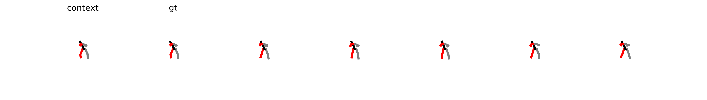
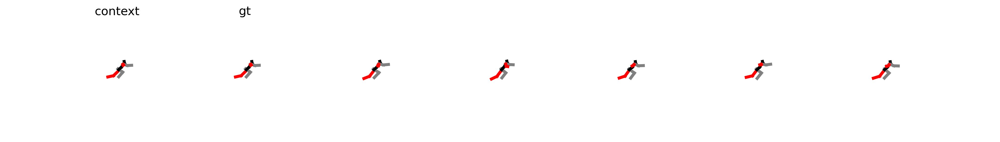
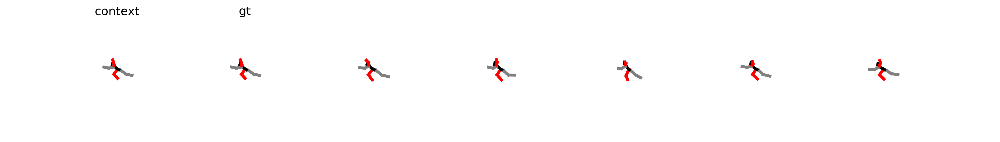
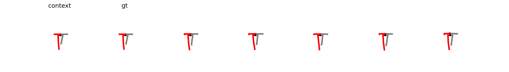
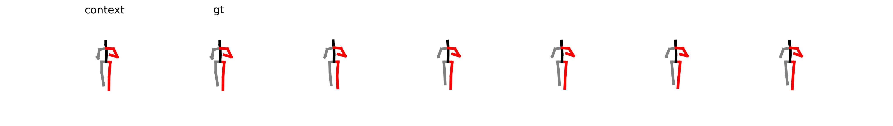
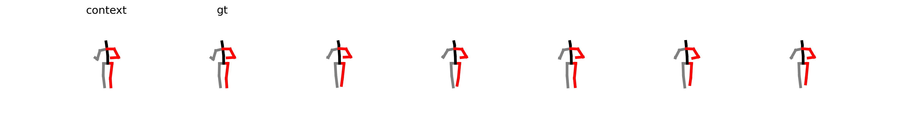
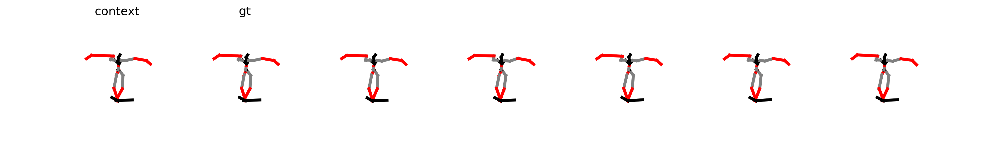
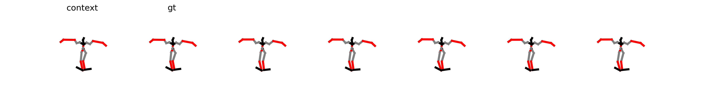
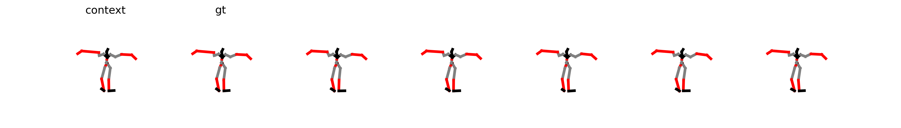

## Code for "AthleticFlow: Flow Matching with Guidance of Human Kinematics for 3D Athletic Motion Prediction".

### Requirements

```
pip install -r requirements.txt
```

`torch`/`torchvision` are pinned to the versions used in development but
should be installed from the [official PyTorch index](https://pytorch.org/get-started/locally/)
for the CUDA build matching your own GPU/driver rather than from PyPI
directly (see the comment at the top of `requirements.txt`).

### Data

Please download all files from [GoogleDrive](https://drive.google.com/drive/folders/1hTTGkzFtvehHheMAltARRHRfy1ZLqQO3?usp=drive_link) and put `/data` directory on the root path of project.

Final `./data` directory structure is shown below:

```
data
├─athlete_pose_3d_v3
│  │  train_box_fps.npy
│  │  train_center_fps.npy
│  │  train_joint_3d_camera.npy
│  │  train_joint_3d_camera_fps.npy
│  │  train_joint_3d_image_fps.npy
│  │  train_meta.joblib
│  │  train_meta_fps.joblib
│  │  train_scale_fps.npy
│  │  valid_box_fps.npy
│  │  valid_center_fps.npy
│  │  valid_joint_3d_camera.npy
│  │  valid_joint_3d_camera_fps.npy
│  │  valid_joint_3d_image_fps.npy
│  │  valid_meta.joblib
│  │  valid_meta_fps.joblib
│  │  valid_scale_fps.npy
│  │
│  └─multimodal
│          data_candi_t_his15_t_pred60_skiprate15.npz
│          t_his15_top50_t_pred60_thre0.100_filtered_dlow.npz
│
├─AthleticsPose
│  │  test.npz
│  │  train.npz
│  │
│  └─multimodal
│          data_candi_t_his15_t_pred60_skiprate15.npz
│          t_his15_1_thre0.500_t_pred60_thre0.100_index_filterd.npz
│
└─worldpose
    │  wp_data_py3.npz
    │
    └─multimodal
            data_candi_t_his25_t_pred100_skiprate25.npz
            t_his25_1_thre0.500_t_pred100_thre0.010_index_filterd.npz
            t_his25_1_thre0.500_t_pred100_thre0.100_index_filterd.npz
```

### Pretrained Model

Checkpoints are large binary files and are not tracked by git in this repo
(see `.gitignore`). Download `athleticflow_pretrained_weights.zip`
from [GoogleDriver](https://drive.google.com/file/d/1hBevcQuZLsq5tSY2Nss_yZti4Na80LY8/view?usp=sharing) and extract it at the root of this project -- it unpacks
directly into `./results/{dataset}_af/models/` (AthleticFlow's own
checkpoints) and `./baselines/*/weights/` (the baseline methods'
checkpoints, see [Baselines](#baselines) below), so no manual file moving
is needed.

### Training

For AthletePose3D:

```
python main_fm.py --cfg ap3d_af --mode train
```

For AthleticsPose:

```
python main_fm.py --cfg ap_af --mode train
```

For WorldPose:

```
python main_fm.py --cfg wp_af --mode train
```

### Evaluation

Evaluate on AthletePose3D:

```
python main_fm.py --cfg ap3d_af --mode eval --ckpt ./results/ap3d_af/models/ckpt_ema_1000.pt
```

Evaluate on AthleticsPose:

```
python main_fm.py --cfg ap_af --mode eval --ckpt ./results/ap_af/models/ckpt_ema_500.pt
```

Evaluate on WorldPose:

```
python main_fm.py --cfg wp_af --mode eval --ckpt ./results/wp_af/models/ckpt_ema_1000.pt
```


### Visualization
#### AthletePose3D



#### AthleticsPose



#### WorldPose



More visualization results can be seen in the 'inference' folder.

### Baselines

`./baselines/` bundles self-contained copies of the 5 baseline methods
compared against AthleticFlow in the paper (TransFusion, HumanMAC, SMRNet,
CoMusion, SDFM) -- source code plus one seed-0 checkpoint per dataset
(ap3d/ap/wp) for each method, so the full comparison in the paper can be
reproduced from this single repo. See `baselines/README.md` for exact
checkpoint provenance and per-method caveats.

Each `baselines/<Method>/` folder is runnable the same way as the
top-level code above (`python main.py --cfg=<id> --mode=train|eval|pred`,
or `main_fm.py` / `train_cs.py` for SDFM / CoMusion respectively -- see
that method's own folder for its exact entry script and cfg ids), and also
ships a `quick_check.py` in each folder: a fast sanity check that loads the
checkpoint and runs one small-batch forward pass without running the full
K=50 evaluation protocol, useful for verifying an environment/checkpoint is
set up correctly before a full run, e.g.:

```
cd baselines/SDFM
python quick_check.py --cfg=ap3d_sdfm --ckpt=weights/ap3d/ckpt_ema_1000_sdfm_seed0.pt
```

As with the top-level checkpoints, `baselines/*/weights/` are not tracked
by git and are included in the `athleticflow_pretrained_weights.zip`
archive described in [Pretrained Model](#pretrained-model).

### Acknowledgments

Part of the code is borrowed from the [HumanMAC](https://github.com/LinghaoChan/HumanMAC) repo.
The `baselines/` folder additionally bundles code adapted from the original
TransFusion, SMRNet, CoMusion, and SDFM implementations used for comparison
in the paper; please cite their respective papers (see the paper's
bibliography) if you use them.

### License

This code is distributed under an [MIT LICENSE](https://github.com/LinghaoChan/HumanMAC/blob/main/LICENSE). Note that our code depends on other libraries and datasets which each have their own respective licenses that must also be followed.

